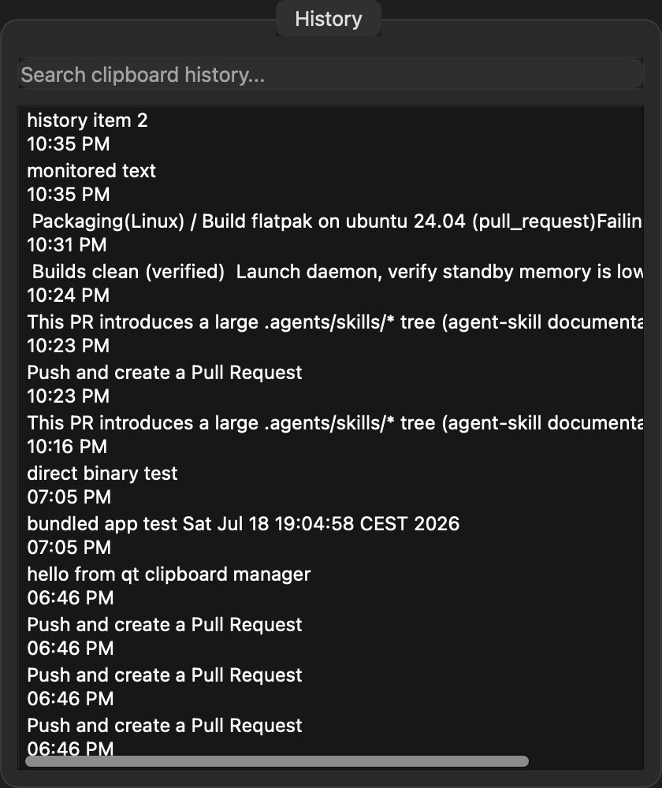
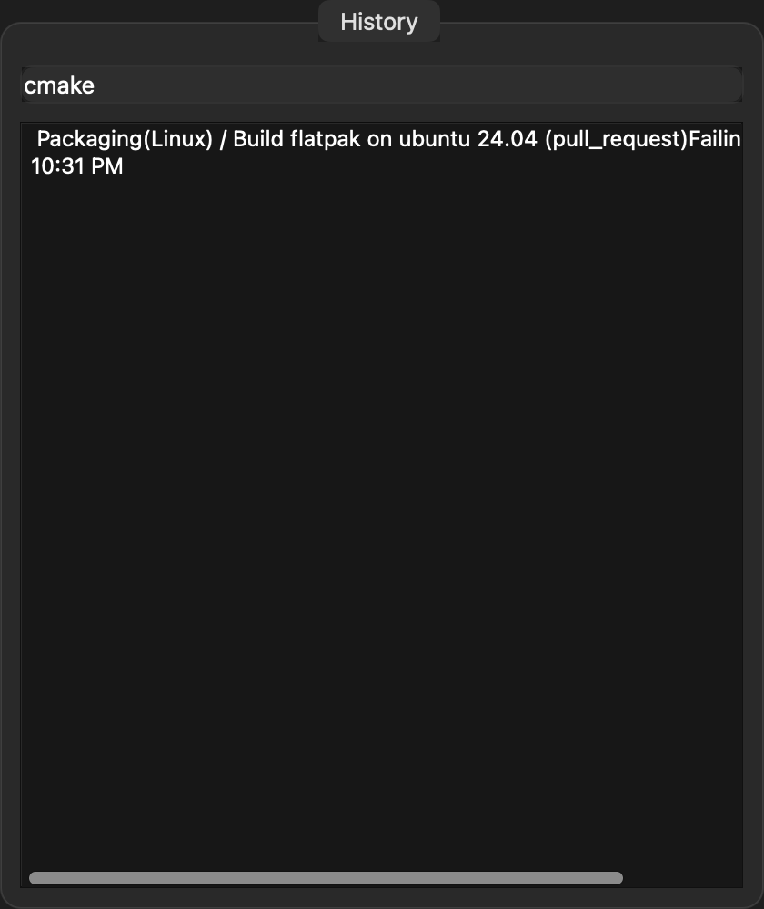

# Clipboard Manager

A lightweight, privacy-first clipboard manager for your menu bar.

Born from the frustration of losing clipboard history. Built to be invisible — it lives in your menu bar, logs everything you copy, and lets you find it instantly.

**153 KB. No Electron. No JavaScript. No analytics. No network. Just your clipboard.**

<!-- DOWNLOADS -->

---

## Screenshots

| Full history | Search in action |
|---|---|
|  |  |

## Why this?

Most clipboard managers are Electron apps that eat 200+ MB of RAM for a list of strings. This one is **C++ on Qt6 Widgets** — native performance with native look.

| Metric | This app |
|---|---|
| Binary size | **153 KB** |
| Memory usage | **~20 MB** |
| Runtime | Native (C++17, Qt6) |
| Privacy | **Zero network. Zero tracking.** Everything stays on your machine. |
| History | Last 100 texts, stored in SQLite |
| Search | Real-time filtering as you type |

## Features

- **Automatic capture** — every text you copy is saved instantly
- **Real-time search** — start typing to filter history
- **Click to re-copy** — any item goes back to your clipboard
- **Right-click to delete** — remove individual items
- **Keyboard friendly** — arrow keys to navigate, Enter to copy
- **Menu bar** — lives in your system tray, stays out of your way
- **Frameless popup** — appears top-right, closes on focus loss
- **Cross-platform** — same codebase runs on macOS, Windows, Linux

## Build

```bash
cd clipboard-manager-qt
cmake -B build -DCMAKE_PREFIX_PATH=$(brew --prefix qt6)
cmake --build build
./build/clipboard-manager-qt
```

### Dependencies

- **macOS**: `brew install qt@6`
- **Ubuntu/Debian**: `sudo apt install qt6-base-dev libqt6sql6-sqlite`
- **Fedora**: `sudo dnf install qt6-qtbase-devel qt6-qtsql-devel`
- **Windows**: Install Qt6 via [aqtinstall](https://github.com/miurahr/aqtinstall) or the [online installer](https://www.qt.io/download)

## Package

```bash
cmake --build build
# macOS:
$(brew --prefix qt6)/bin/macdeployqt build/Clipboard\ Manager.app
# Linux:
cpack -G DEB   # or RPM, AppImage
# Windows:
cpack -G NSIS  # or ZIP
```

## Tests

```bash
cd clipboard-manager-qt
cmake -B build -DCMAKE_PREFIX_PATH=$(brew --prefix qt6)
cmake --build build
ctest --test-dir build
```

Includes E2E tests with screenshot capture. Screenshots regenerate on each run.

## License

MIT
